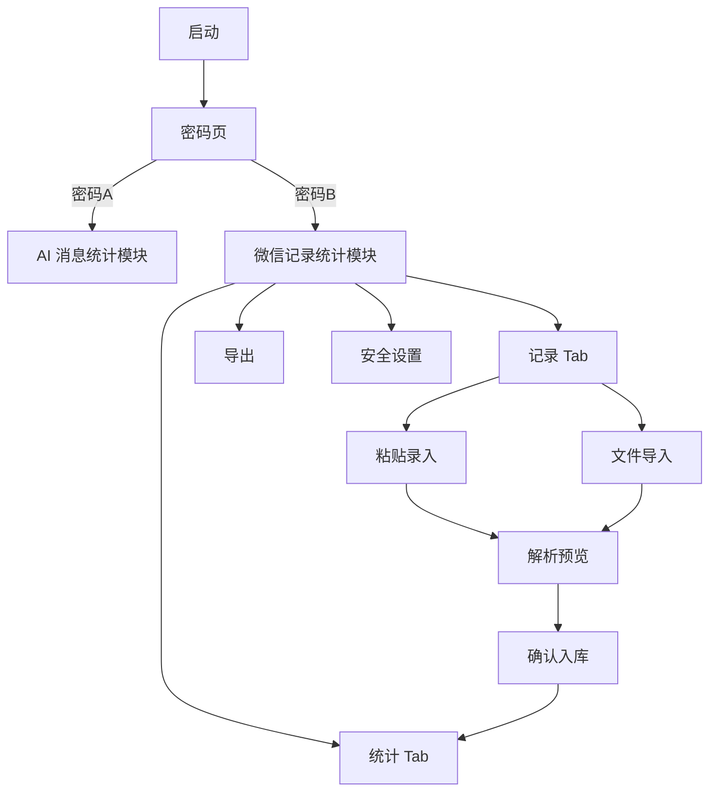
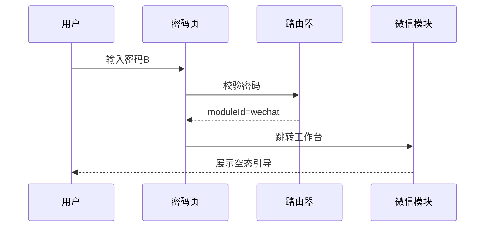
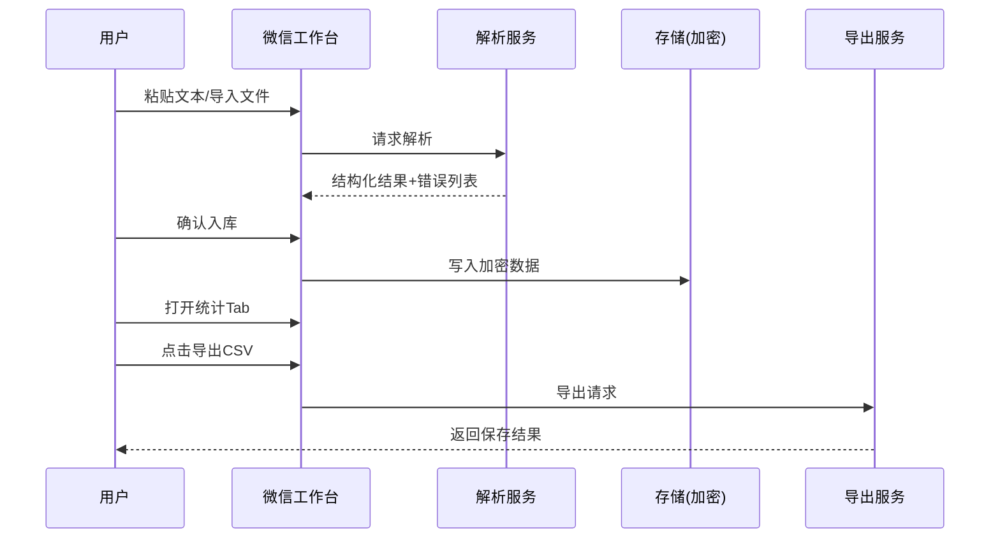

# MessageCounter 微信模块 V1 UI/UE 规格说明

## 0. 文档信息
- 版本：v1.0
- 日期：2026-02-25
- 适用范围：Electron 桌面端（macOS / Windows）
- 关联需求：启动密码分流 + 微信聊天记录（手动粘贴/导入）+ 基础统计 + CSV 导出 + 本地加密

## 1. 目标与边界
### 1.1 目标
1. 启动后统一进入密码页。
2. 不同密码进入不同业务模块：
   - 密码A -> 现有“AI 消息统计模块”
   - 密码B -> 新增“微信聊天记录统计模块”
3. 微信模块完成 V1 主路径：录入/导入 -> 解析确认 -> 统计查看 -> CSV 导出。
4. 聊天数据全程本地加密存储，未解锁不可见明文。

### 1.2 非目标（V1 不做）
1. 读取微信本地数据库。
2. 自动抓取/监听微信客户端。
3. 云同步与跨设备合并。
4. Excel/PDF 导出。

## 2. 设计原则
1. 单任务高通量：把高频动作集中在一个工作台完成，减少页面跳转。
2. 可验证优先：任何导入数据先预览、再确认入库，避免脏数据污染统计。
3. 安全默认开启：以“先解锁、后访问”为默认路径，明文最小暴露。
4. 渐进增强：V1 保证“纯记录+统计+导出”稳定，解析器扩展能力预留插槽。

## 3. 用户与核心任务
### 3.1 目标用户
- 日常通过聊天文本做业务记录和复盘的运营用户。
- 对数据准确性和导出效率敏感，技术门槛中低。

### 3.2 Top Tasks（按频次）
1. 快速录入当天聊天记录（粘贴文本）。
2. 导入历史记录文件（txt/csv/json）。
3. 查统计结论（消息量、联系人、日期趋势、关键词）。
4. 导出 CSV 给他人或留档。

## 4. 信息架构（IA）


## 5. 导航与路由规范
### 5.1 路由结构
- `/auth`：密码入口页
- `/module/lottery`：六合彩模块（现有）
- `/module/wechat`：微信模块工作台（新增）

### 5.2 密码分流策略
- 采用配置映射，不在 UI 层写死：`password -> moduleId`。
- 登录成功仅返回 `moduleId`，不向渲染层暴露原始密码。
- 连续失败触发轻量防刷（例如短暂禁用输入 10s）。

## 6. 页面规格

### 6.1 页面 A：密码入口（/auth）
#### 目标
- 统一入口，完成安全校验与业务分流。

#### 布局
- 居中卡片（固定宽度 420px）：
  - 标题：`请输入访问密码`
  - 输入框（password）
  - 主按钮：`进入系统`
  - 次要信息：错误反馈 / 尝试次数 / 锁定倒计时

#### 交互规则
1. Enter 提交。
2. 空值提交提示：`请输入密码`。
3. 错误密码提示：`密码错误，请重试`。
4. 成功后 300ms 内跳转目标模块。

#### 状态
- 默认态
- 错误态（红色提示 + 输入框错误边框）
- 冻结态（倒计时 + 按钮禁用）

### 6.2 页面 B：微信模块工作台（/module/wechat）
#### 目标
- 在单页完成记录、解析、统计、导出。

#### 桌面布局（3 栏）
1. 顶部工具栏（固定高）
   - `新建会话` `粘贴记录` `导入文件` `导出CSV` `安全设置`
   - 当前解锁状态：`已加密存储` 徽标
2. 左栏（260px）
   - 会话搜索
   - 会话列表（按日期分组）
   - 新建会话入口
3. 中栏（弹性）
   - Tab：`原始记录` `结构化预览` `统计结果`
4. 右栏（320px）
   - 实时摘要卡片：总消息、联系人数、活跃天数、解析异常数

#### 关键交互
1. 切换会话时保留当前筛选条件。
2. 粘贴后自动预解析；若失败，停留在“结构化预览”并展示错误行。
3. 统计 Tab 支持按时间区间筛选（今天/7天/30天/自定义）。

#### 空态
- 无会话：显示引导卡片 `先新建会话或导入记录`。
- 无统计：显示 `暂无可统计数据`。

### 6.3 页面 C：导入向导（Modal）
#### 目标
- 低错误率导入 txt/csv/json。

#### 步骤
1. 选择来源
   - 拖拽区 + 文件选择按钮
   - 支持格式提示：`txt / csv / json`
2. 字段映射（csv/json）
   - 必填映射：时间、发送者、内容
   - 可选映射：会话名、消息类型
3. 预览确认
   - 展示前 20 条
   - 标记无法解析行
   - 操作：`仅导入有效行` 或 `返回修正`

#### 校验
- 必填字段缺失：禁止进入下一步。
- 文件过大（例如 >20MB）：提示分批导入。
- 编码异常：提示转 UTF-8 后重试。

### 6.4 页面 D：粘贴录入弹窗（Modal）
#### 目标
- 提供极简快速录入通道。

#### 组件
- 多行文本输入
- 会话选择器
- 解析预览（行号 + 结果 + 错误说明）
- 按钮：`解析` `确认入库` `清空`

#### 体验策略
1. 打开即聚焦输入框。
2. `Cmd/Ctrl + Enter` 触发确认。
3. 对错误行做行内提示，避免全局报错不知定位。

### 6.5 页面 E：统计视图（中栏 Tab）
#### 目标
- 让用户在 10 秒内读出“量级、结构、趋势”。

#### 区块
1. KPI 卡片
   - 消息总数
   - 联系人数量
   - 活跃天数
   - 平均每日消息
2. 趋势图
   - 按日消息数量折线图
3. 联系人分布
   - 条形图（Top 10）
4. 关键词 TopN
   - 词频表（可过滤停用词）

#### 筛选器
- 会话范围
- 时间范围
- 关键词包含/排除

### 6.6 页面 F：导出弹窗（Modal）
#### 目标
- 用最少步骤完成 CSV 导出。

#### 字段
- 导出范围：`当前会话 / 当前筛选结果 / 全部数据`
- 字段勾选：时间、发送者、内容、会话、关键词标签
- 文件命名（默认）：`wechat_export_YYYYMMDD_HHmm.csv`

#### 反馈
- 成功：显示文件保存路径 + `打开所在目录`
- 失败：给出错误原因（权限不足/路径不可写）

### 6.7 页面 G：安全设置（Drawer/Modal）
#### 目标
- 可见、可控的安全能力。

#### 功能
1. 显示加密状态：`已启用 AES-256-GCM`。
2. 修改模块密码B。
3. 一键清除微信模块本地数据（强确认）。
4. 最近解锁时间与设备标识（只读）。

### 6.8 低保真线框（工作台）
```text
+--------------------------------------------------------------------------------------+
| 顶部工具栏: [新建会话] [粘贴记录] [导入文件] [导出CSV] [安全设置]      [已加密存储] |
+--------------------------------------------------------------------------------------+
| 左栏(260)                 | 中栏(弹性)                               | 右栏(320)     |
|---------------------------|-------------------------------------------|----------------|
| 搜索会话 [___________]    | Tab: [原始记录] [结构化预览] [统计结果]   | 摘要卡片        |
|                           |-------------------------------------------| - 消息总数      |
| 2026-02-25                | 原始记录列表 / 解析预览表 / 图表          | - 联系人数      |
| - 客诉会话A               |                                           | - 活跃天数      |
| - 售后会话B               |                                           | - 异常行数      |
|                           |                                           |                |
| 2026-02-24                |                                           | 快捷筛选        |
| - 跟单会话C               |                                           | [今天][7天][30天]|
|                           |                                           |                |
| [+ 新建会话]              |                                           |                |
+--------------------------------------------------------------------------------------+
```

### 6.9 响应式与尺寸策略
1. `>= 1440px`：三栏完整布局（260 / auto / 320）。
2. `1200px - 1439px`：右栏折叠为可展开抽屉，默认只显示关键 KPI。
3. `< 1200px`：左栏改抽屉，主区域优先；导入/导出统一走全屏弹窗模式。
4. 最小可用宽度：`1024px`；低于该宽度给出“建议放大窗口”提示。

## 7. 关键流程（UE）

### 7.1 首次使用流程


### 7.2 录入到导出主流程


## 8. 组件清单（V1）
1. `AuthCard`：密码输入、错误反馈、倒计时。
2. `ModuleShell`：模块公共容器（标题、工具栏、状态徽标）。
3. `SessionList`：会话分组、搜索、选中状态。
4. `PasteInputModal`：快速录入。
5. `ImportWizardModal`：三步导入。
6. `ParsePreviewTable`：结构化预览和错误标注。
7. `StatsBoard`：KPI+图表容器。
8. `ExportModal`：CSV 导出。
9. `SecurityDrawer`：加密状态与安全操作。

## 9. 视觉规范（Design Tokens）
### 9.1 色彩
- `--bg-root: #F4F7F9`
- `--bg-panel: #FFFFFF`
- `--text-primary: #102A43`
- `--text-secondary: #486581`
- `--accent: #0E9F6E`
- `--accent-weak: #E6F6EF`
- `--danger: #D64545`
- `--border: #D9E2EC`

### 9.2 字体
- 中文：`Source Han Sans SC`
- 数字/时间：`JetBrains Mono`

### 9.3 间距与圆角
- 间距刻度：4 / 8 / 12 / 16 / 24 / 32
- 卡片圆角：12px
- 弹窗圆角：14px

### 9.4 动效
- 页面切换：150ms ease-out
- 弹窗出现：180ms（opacity + translateY）
- 图表刷新：200ms 淡入

## 10. 交互与可用性细则
1. 所有危险操作二次确认（清空数据、覆盖导入）。
2. 所有导入错误必须可定位到行号。
3. 主要操作都有键盘路径：
   - `Enter` 提交
   - `Esc` 关闭弹窗
   - `Cmd/Ctrl + Enter` 确认入库
4. 长任务反馈：>400ms 显示加载状态。
5. 任何失败必须提供下一步动作（重试/修改/取消）。

### 10.1 关键文案规范（Microcopy）
1. 按钮文案使用动词开头：`导入文件`、`确认入库`、`导出 CSV`。
2. 错误文案采用“原因 + 建议”结构：
   - `第 24 行缺少时间字段，请在映射中补充“时间”列后重试。`
3. 成功文案强调结果与下一步：
   - `已成功导出 1,238 条记录，可前往目录查看文件。`
4. 危险操作使用显式后果：
   - `清除后不可恢复，确定删除本地微信数据吗？`

## 11. 无障碍与国际化
### 11.1 无障碍
1. 主要交互控件键盘可达。
2. 对比度满足 WCAG AA（文本与背景 >= 4.5:1）。
3. 错误信息不只用颜色表达，必须带图标或文本。

### 11.2 国际化
- V1 仅中文文案，但组件文本采用 key 管理，预留 i18n。

## 12. 数据结构与 UI 映射
### 12.1 统一消息结构（前端视角）
```json
{
  "id": "msg_xxx",
  "sessionId": "session_xxx",
  "timestamp": "2026-02-25T10:12:00+08:00",
  "sender": "张三",
  "content": "今晚8点开会",
  "type": "text",
  "source": "paste | file_import",
  "raw": "原始行文本"
}
```

### 12.2 统计结构（前端视角）
```json
{
  "totalMessages": 1320,
  "totalSenders": 27,
  "activeDays": 24,
  "dailyTrend": [{ "date": "2026-02-01", "count": 35 }],
  "senderTop": [{ "sender": "张三", "count": 120 }],
  "keywordTop": [{ "keyword": "发货", "count": 80 }]
}
```

### 12.3 加密约束
1. 原始记录和结构化记录均加密落盘。
2. UI 层只拿解密后的内存数据，不直接操作密钥。
3. 解锁态关闭后，清空敏感内存缓存。

## 13. 指标与验收
### 13.1 可用性指标
1. 新用户从解锁到导出 CSV，3 分钟内完成。
2. 粘贴后 10 秒内看到解析预览与基础统计。
3. 导入 1 万行文本时界面保持可响应（无明显卡死）。

### 13.2 验收清单
1. 密码A/B 可稳定分流到不同模块。
2. 微信模块支持手动粘贴和 txt/csv/json 导入。
3. 解析失败行可回看行号和原因。
4. 统计面板展示 KPI + 趋势 + TopN。
5. 支持按筛选条件导出 CSV。
6. 应用重启后，未解锁无法读取明文。

## 14. 研发落地拆分（建议）
1. 里程碑 M1：密码入口与模块路由（1-2 天）
2. 里程碑 M2：微信工作台与会话管理（2-3 天）
3. 里程碑 M3：粘贴/导入/解析预览（3-4 天）
4. 里程碑 M4：统计面板与筛选（2-3 天）
5. 里程碑 M5：CSV 导出与安全设置（1-2 天）
6. 里程碑 M6：验收回归与体验修正（1-2 天）

## 15. 后续扩展位（V1.1+）
1. 可配置解析器（不同数据源模板）。
2. 导出 Excel/PDF。
3. 预置统计看板模板（运营/客服/销售）。
4. 自动归档策略（按会话或时间）。
